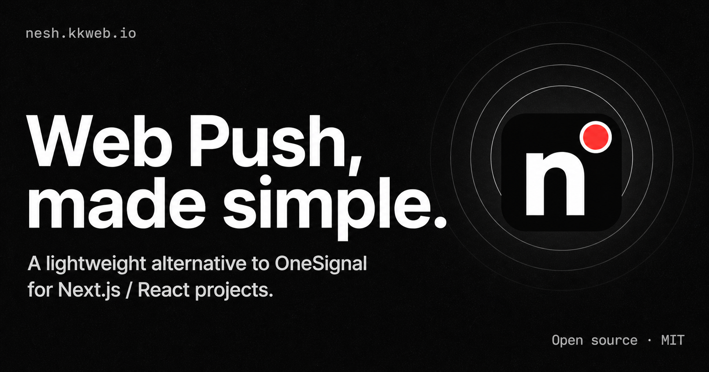
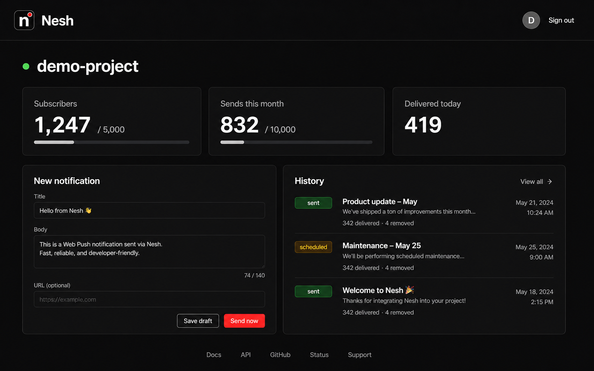

<p align="center">
  <a href="https://nesh.kkweb.io">
    
  </a>
</p>

<h1 align="center">Nesh</h1>

<p align="center">
  Web Push notifications, made simple.<br/>
  A lightweight, open-source alternative to OneSignal for Next.js / React projects.
</p>

<p align="center">
  <a href="https://nesh.kkweb.io"></a>
  <a href="https://www.npmjs.com/package/@piro0919/next-push"></a>
  <a href="LICENSE"></a>
</p>

---

## What is Nesh?

If you've ever needed Web Push notifications for a side project and found OneSignal's segmentation, journeys, and A/B testing to be 95% feature bloat — Nesh is the boring 5%.

- **Sign up**, create a project, get an API base + VAPID public key
- **Drop in the SDK** ([`@piro0919/next-push`](https://www.npmjs.com/package/@piro0919/next-push)) — one hook + one service worker
- **Send** notifications from the dashboard or via a REST API. Immediate or scheduled.

Nesh is **to OneSignal what Umami is to Google Analytics** — a smaller, friendlier alternative for people who don't need the enterprise features.

> Hosted at **[nesh.kkweb.io](https://nesh.kkweb.io)** · Docs at **[nesh.kkweb.io/docs](https://nesh.kkweb.io/docs)** · Free during early access · MIT licensed · Built by a solo developer

<p align="center">
  
</p>

## Quick start (using the hosted Nesh)

```tsx
'use client';
import { usePush } from "@piro0919/next-push";

export function Subscribe() {
  const { subscribe } = usePush({
    apiBase: "https://nesh.kkweb.io/api/v1/projects/<projectId>",
    vapidPublicKey: "<VAPID public key from your project>",
    // Optional — scope subscriptions to your application's user id
    // so you can target sends by user from the dashboard / REST API.
    userId: currentUser.id,
  });
  return <button onClick={subscribe}>Enable notifications</button>;
}
```

Then add a service worker at `/public/sw.js`:

```js
self.addEventListener("push", (event) => {
  const data = event.data?.json() ?? {};
  event.waitUntil(
    self.registration.showNotification(data.title ?? "Nesh", {
      body: data.body,
      data: { url: data.url },
    }),
  );
});

self.addEventListener("notificationclick", (event) => {
  event.notification.close();
  const url = event.notification.data?.url ?? "/";
  event.waitUntil(self.clients.openWindow(url));
});
```

That's the whole client-side integration. See [`examples/next-app`](examples/next-app) for a runnable sample.

## Send via REST API

```bash
curl -X POST https://nesh.kkweb.io/api/v1/projects/<id>/notifications \
  -H "Authorization: Bearer nesh_sk_..." \
  -H "Content-Type: application/json" \
  -d '{
    "title": "Hello",
    "body": "From the API",
    "url": "https://example.com",
    "userIds": ["alice", "bob"]
  }'
```

`userIds` is optional — omit it to broadcast to every subscriber.

## Free tier

The hosted version is free during early access, with hard caps to keep this sustainable as a one-person side project:

| Quota | Limit |
| --- | --- |
| Projects per user | **1** |
| Subscribers per project | **5,000** |
| Sends per project per UTC month | **10,000** |

If you'd hit those ceilings, please open an issue — long-term pricing isn't decided yet, and that signal genuinely helps.

## Stack

- **Next.js 16** (App Router, Server Actions, the new `proxy.ts`) on **React 19**
- **Supabase** (Postgres + Auth + RLS)
- **Vercel** (hosting + Cron for scheduled sends)
- **shadcn/ui** + **Tailwind v4** with system / light / dark theme via `next-themes`
- **next-intl** for English / 日本語
- **[`@piro0919/next-push`](https://github.com/piro0919/next-push)** for the actual sending (web-push + VAPID)

VAPID private keys are stored AES-256-GCM encrypted at rest. Subscriptions optionally carry an `external_user_id` for targeted sends. Webhooks fire HMAC-SHA256-signed `notification.sent` / `subscription.created` / `subscription.removed` events.

## Self-host

Nesh is MIT-licensed and runs anywhere with Postgres + a Node-compatible host. See the full **[self-hosting guide](https://nesh.kkweb.io/docs/self-host)** for step-by-step instructions, including required env vars, cron scheduling outside Vercel, and operational notes.

### Local development

Prerequisites: Node.js 20+, pnpm 9+, Docker (for local Supabase).

```bash
pnpm install
pnpm db:start                     # local Postgres + Auth + Studio
cp .env.example .env.local        # paste keys printed by db:start
pnpm db:reset                     # apply migrations
pnpm dev                          # http://localhost:3000
```

Other scripts:

- `pnpm db:types` — regenerate `src/lib/supabase/database.types.ts` from the local schema
- `pnpm db:stop` — stop the local Supabase stack
- `pnpm lint` / `pnpm format` — Biome
- `pnpm test` / `pnpm test:e2e` — vitest / Playwright

### Required environment variables

| Variable | Purpose |
| --- | --- |
| `NEXT_PUBLIC_SUPABASE_URL` / `NEXT_PUBLIC_SUPABASE_ANON_KEY` | Browser-side Supabase client |
| `SUPABASE_SERVICE_ROLE_KEY` | Server-side admin client (bypasses RLS) |
| `NEXT_PUBLIC_SITE_URL` | Public origin — used for apiBase + event tracking URLs |
| `CRON_SECRET` | Bearer token guarding `/api/cron/dispatch` |
| `VAPID_KEY_ENCRYPTION_KEY` | 32-byte base64 key for at-rest VAPID encryption |
| `ADMIN_USER_IDS` | Optional. Comma-separated user UUIDs that can access `/admin` |

## Contributing

Bug reports and PRs welcome. Please open an issue first for non-trivial changes so we can align on direction.

## License

[MIT](LICENSE) © [piro0919](https://github.com/piro0919)
